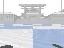

# Drone Trial Racing with RL

## Dependencies
* [`gym-pubullet-drones`](https://github.com/utiasDSL/gym-pybullet-drones)
    * Major dependencies are [`gym`](https://gym.openai.com/docs/),  [`pybullet`](https://docs.google.com/document/d/10sXEhzFRSnvFcl3XxNGhnD4N2SedqwdAvK3dsihxVUA/edit#)
    
## Envrionment Installation

Assumes you have Anaconda installed for environment, but can use any virtual environment
```
conda create -n droneEnv python=3.8
conda activate droneEnv
pip3 install --upgrade numpy Pillow matplotlib cycler 
pip3 install --upgrade gym pybullet stable_baselines3 'ray[rllib]'
```
Video recording requires to have [`ffmpeg`](https://ffmpeg.org) installed, on *macOS*
```
$ brew install ffmpeg
```
On *Ubuntu*
```
$ sudo apt install ffmpeg
```
Video recordings not compatible with *Windows* yet


## Overview
Implement a drone agent that can complete the TrackV1 map course. Specifically you must: 
* Choose an observation and action type, elaborated below.
* Define the reward for your drone agent in `track.py` via the `_computeReward` function, an example implementation has been left in there, however this will not work to achieve completion of the track.
* Implement a proper action in `train.py`, you may add any necessary files and use any algorithms to achieve this. 
* Train your agent!

### Observation
Sent as a parameter to `env = TrackV1(obs="kin", ...)` in `train.py`

There are two observation types available that you can specify during the environments creation to determine what 
type of observation your agent will receive.
* `KIN = "kin"`:
  * `(12,)`-shaped array containing kinematic information (pose, linear and angular velocities), specifically,
    * `[0:3]` X, Y, Z position in WORLD\_FRAME (in meters) (3 values)
    * `[3:6]` Roll, pitch and yaw angles in WORLD\_FRAME (in radians, 3 values)
    * `[6:9]` The velocity vector in WORLD\_FRAME (in m/s, 3 values)
    * `[9:12]` Angular velocity in WORLD\_FRAME (3 values)
* `RGB = "rgb"`: 
  * `(H, W, 4)`-shaped array containing  RGB camera capture in the drone's POV, specifically,
    * 4 channels for red, green, blue, (and alpha)
    * On-board RGB View


### Action
Sent as a parameter to `env = TrackV1(act="rpm", ...)` in `train.py`

There are multiple action types available that you can specify during the environments creation to determine what type
of actions your agent will use. I recommend using RPM as it's the easiest to understand. 
* `RPM = "rpm"`:
  * `(4,)`-shaped array containing the RPMS to apply to each of the 4 motors
* `DYN = "dyn"`:
  * `(4,)`-shaped array containing [Desired thrust along the drone's z-axis, Desired drone's x-axis torque, Desired drone's y-axis torque, Desired drone's z-axis torque]
* `PID = "pid"`:
  * `(3,)`-shaped array containing the change in desired position in [x, y, z]
* `VEL = "vel"`:
  * `(4,)`-shaped array containing the target velocity vector (using PID control)
* `TUN = "tun"`:
  * Type: `Box(6,)`
  * `(6,)`-shaped array containing new coefficients of a PID controller. i.e. [position control proportional coefficient, position control integral coefficient, position control derivative coefficient, attitude control proportional coefficient, attitude control integral coefficient, attitude control derivative coefficient]
* `ONE_D_RPM = "one_d_rpm"`:
  * `(1,)`-shaped array containing the RPM to apply to all the 4 motors (identical input to all motors)
* `ONE_D_DYN = "one_d_dyn"`:
  * `(1,)`-shaped array containing the desired thrust along the drone'z z-axis. (torques 0 for x, y, z axis)
* `ONE_D_PID = "one_d_pid"`:
  * `(1,)`-shaped array containing the change in desired position along the z-axis. (0 input for x, y axis)
    
Note these are all implied to be numpy arrays. i.e. your action to just float straight up using "rpm" would look like: `numpy.array([0.1, 0.1, 0.1, 0.1])`

Note that your actions are clipped to realism, i.e. you can't make the drone fly at light speed.

For further information, the action you send to the environment will first go through this preprocessing step which will
essentially convert whatever action type you chose into `(4,)`-shaped array of floats containing to clipped RPMs
commanded to the 4 motors of each drone. This function, shown here, can be found in `gym-pybullet-drones/gym_pybullet_drones/envs/single_agent_rl/BaseSingleAgentAviary.py`:
<details>
<summary>_preprocessAction function</summary>

```Python
def _preprocessAction(self,
                      action
                      ):
    """Pre-processes the action passed to `.step()` into motors' RPMs.
    Parameter `action` is processed differenly for each of the different
    action types: `action` can be of length 1, 3, 4, or 6 and represent 
    RPMs, desired thrust and torques, the next target position to reach 
    using PID control, a desired velocity vector, new PID coefficients, etc.
    Parameters
    ----------
    action : ndarray
        The input action for each drone, to be translated into RPMs.
    Returns
    -------
    ndarray
        (4,)-shaped array of ints containing to clipped RPMs
        commanded to the 4 motors of each drone.
    """
    if self.ACT_TYPE == ActionType.TUN:
        self.ctrl.setPIDCoefficients(p_coeff_pos=(action[0]+1)*self.TUNED_P_POS,
                                     i_coeff_pos=(action[1]+1)*self.TUNED_I_POS,
                                     d_coeff_pos=(action[2]+1)*self.TUNED_D_POS,
                                     p_coeff_att=(action[3]+1)*self.TUNED_P_ATT,
                                     i_coeff_att=(action[4]+1)*self.TUNED_I_ATT,
                                     d_coeff_att=(action[5]+1)*self.TUNED_D_ATT
                                     )
        return self._trajectoryTrackingRPMs() 
    elif self.ACT_TYPE == ActionType.RPM:
        return np.array(self.HOVER_RPM * (1+0.05*action))
    elif self.ACT_TYPE == ActionType.DYN:
        return nnlsRPM(thrust=(self.GRAVITY*(action[0]+1)),
                       x_torque=(0.05*self.MAX_XY_TORQUE*action[1]),
                       y_torque=(0.05*self.MAX_XY_TORQUE*action[2]),
                       z_torque=(0.05*self.MAX_Z_TORQUE*action[3]),
                       counter=self.step_counter,
                       max_thrust=self.MAX_THRUST,
                       max_xy_torque=self.MAX_XY_TORQUE,
                       max_z_torque=self.MAX_Z_TORQUE,
                       a=self.A,
                       inv_a=self.INV_A,
                       b_coeff=self.B_COEFF,
                       gui=self.GUI
                       )
    elif self.ACT_TYPE == ActionType.PID: 
        state = self._getDroneStateVector(0)
        rpm, _, _ = self.ctrl.computeControl(control_timestep=self.AGGR_PHY_STEPS*self.TIMESTEP, 
                                             cur_pos=state[0:3],
                                             cur_quat=state[3:7],
                                             cur_vel=state[10:13],
                                             cur_ang_vel=state[13:16],
                                             target_pos=state[0:3]+0.1*action
                                             )
        return rpm
    elif self.ACT_TYPE == ActionType.VEL:
        state = self._getDroneStateVector(0)
        if np.linalg.norm(action[0:3]) != 0:
            v_unit_vector = action[0:3] / np.linalg.norm(action[0:3])
        else:
            v_unit_vector = np.zeros(3)
        rpm, _, _ = self.ctrl.computeControl(control_timestep=self.AGGR_PHY_STEPS*self.TIMESTEP, 
                                             cur_pos=state[0:3],
                                             cur_quat=state[3:7],
                                             cur_vel=state[10:13],
                                             cur_ang_vel=state[13:16],
                                             target_pos=state[0:3], # same as the current position
                                             target_rpy=np.array([0,0,state[9]]), # keep current yaw
                                             target_vel=self.SPEED_LIMIT * np.abs(action[3]) * v_unit_vector # target the desired velocity vector
                                             )
        return rpm
    elif self.ACT_TYPE == ActionType.ONE_D_RPM:
        return np.repeat(self.HOVER_RPM * (1+0.05*action), 4)
    elif self.ACT_TYPE == ActionType.ONE_D_DYN:
        return nnlsRPM(thrust=(self.GRAVITY*(1+0.05*action[0])),
                       x_torque=0,
                       y_torque=0,
                       z_torque=0,
                       counter=self.step_counter,
                       max_thrust=self.MAX_THRUST,
                       max_xy_torque=self.MAX_XY_TORQUE,
                       max_z_torque=self.MAX_Z_TORQUE,
                       a=self.A,
                       inv_a=self.INV_A,
                       b_coeff=self.B_COEFF,
                       gui=self.GUI
                       )
    elif self.ACT_TYPE == ActionType.ONE_D_PID:
        state = self._getDroneStateVector(0)
        rpm, _, _ = self.ctrl.computeControl(control_timestep=self.AGGR_PHY_STEPS*self.TIMESTEP, 
                                             cur_pos=state[0:3],
                                             cur_quat=state[3:7],
                                             cur_vel=state[10:13],
                                             cur_ang_vel=state[13:16],
                                             target_pos=state[0:3]+0.1*np.array([0,0,action[0]])
                                             )
        return rpm
```
</details>

### Reward
In `track.py`

You must implement the reward function for the environment that your agent will use. Here are some useful things
you have access to from the environment that you might want to incorporate into the reward, but feel free to use
anything available. Note: These are all attributes or instance variables of the environment

* `self.step_counter`: The current step counter. Increases everytime `env.step()` is called, specifically `self.step_counter = self.step_counter + (1 * self.AGGR_PHY_STEPS)`. Resets to 0 when env.reset() is called
  * `self.AGGR_PHY_STEPS`: The number of physics steps within one call to `env.step()`, 1 by default
* `self.EPISODE_LEN_SEC`: Len of one episode in seconds, by default is 120. `self.step_counter / self.SIM_FREQ > self.EPISODE_LEN_SEC` determines the final step. Can change with a parameter sent to `env = TrackV1(EPISODE_LEN_SEC=120, ...)`
  * `self.SIM_FREQ` is 240 by default.
* `self._getDroneStateVector(droneIndex)`: `(20,)`-shaped array with various information on the drones current state such as position, rpms, velocity, last action, etc. The specific variables present at indices are specified below.
  * `[0:3]` contains `(3,)`-shaped array of the [x, y, z] coordinates of the drone
  * `[3:7]` contains `(4,)`-shaped array of the quaternion defining the base position and orientation of the drone
  * `[7:10]` contains `(3,)`-shaped array of the roll, pitch, yaw states of the drone
  * `[10:13]` contains `(3,)`-shaped array of the [x_velocity, y_velocity, z_velocity]
  * `[13:16]` contains `(3,)`-shaped array of the [x_angular_velocity, y_angular_velocity, z_angular_velocity]
  * `[16:20]` contains `(4,)`-shaped array of the last clipped action taken
* `self.ring_index`: defaults to 0, variable for you to keep track of the current ring the drone has flown through, you must update this when necessary.
* `self.rings`: Coordinates of all the rings in the map,`[[2, 1, 1.25], [5, 3, 1.25], [4, 6, 1.25], [1, 7, 1.25], [-1, 5, 1.25], [-3, 3, 1.25], [-1, 1, 1.25]]`

Feel free to use any or all of this information in any of your code. 

## References 

* [Learning to Fly---a Gym Environment with PyBullet Physics for Reinforcement Learning of Multi-agent Quadcopter Control](https://arxiv.org/abs/2103.02142)
  * [gym-pubullet-drones](https://github.com/utiasDSL/gym-pybullet-drones)